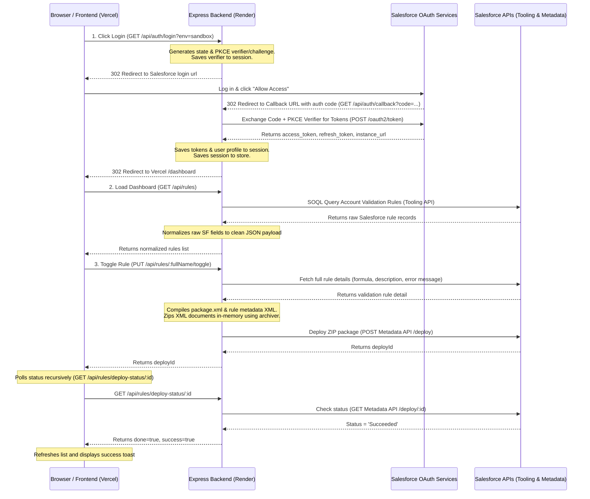

# Salesforce Validation Rule Manager — Complete Interview Preparation Guide

This guide is designed to prepare you to walk through this project in technical interviews. It explains the project's architecture, details every file and its location, explains advanced concepts (such as PKCE, cookies, and Metadata deployments), and lists the top 10 interview questions you are likely to be asked.

> [!TIP]
> To read this file in VS Code in a formatted preview layout, open this file and press **`Ctrl + Shift + V`**.
> To save this as a PDF, install the **"Markdown PDF"** extension in VS Code, right-click inside this file, and select **"Markdown PDF: Export (pdf)"**.

---

## Part 1: How to Pitch the Project (The 1-Minute Elevator Pitch)

*“For my project, I built a full-stack **Salesforce Validation Rule Manager** application. The goal of the app is to allow Salesforce administrators to view and toggle (enable/disable) Account validation rules instantly in a custom UI, without having to navigate the slow Salesforce Setup menus. 
It uses **React and Vite** on the frontend, and a **Node.js + Express** server on the backend. 
Technically, it connects to any Salesforce Developer Org or Sandbox dynamically using a secure **OAuth 2.0 Web Server flow with PKCE**. It queries rules using the **Tooling API**, packages metadata changes in memory using a **ZIP stream pipeline**, and deploys them back to Salesforce via the **Metadata API**. I also configured **cross-domain secure cookies** and reverse proxy trust to deploy the frontend on Vercel and the backend on Render.”*

---

## Part 2: High-Level Architecture & Data Flow



---

## Part 3: File-by-File Walkthrough & Code Explanations

Here is where every key file is located, what it does, and the technical details you should know.

### 1. Backend Configuration: [server/config/salesforce.js](file:///C:/Users/sreev/.gemini/antigravity/scratch/sf-rule-manager/server/config/salesforce.js)
* **What it does**: Holds Salesforce configuration variables read from environment variables and builds the initial OAuth authorization URL.
* **Key Code Explained**:
  * `sanitizeEnvVar()` cleans up variables to strip out double quotes (`"`), single quotes (`'`), or backslashes (`\`) that might have been accidentally pasted in Render's dashboard.
  * `buildAuthorizeUrl(state, codeChallenge, loginUrl)` dynamically accepts a `loginUrl` (`https://login.salesforce.com` for production/developer accounts or `https://test.salesforce.com` for sandboxes) to construct the correct login gateway.

### 2. Backend Entry Point: [server/server.js](file:///C:/Users/sreev/.gemini/antigravity/scratch/sf-rule-manager/server/server.js)
* **What it does**: Imports `dotenv/config` to load variables from a local `.env` file, imports the Express app, and listens on `process.env.PORT` (or defaults to `3001` locally).

### 3. Express Application Setup: [server/app.js](file:///C:/Users/sreev/.gemini/antigravity/scratch/sf-rule-manager/server/app.js)
* **What it does**: Sets up CORS, JSON parsers, session middleware, reverse proxy trust, routing, and global error handlers.
* **Key Code Explained**:
  * `app.set('trust proxy', true)`: Essential for production. Tells Express that it is running behind reverse proxies (Render load balancers + Cloudflare) and should trust the `X-Forwarded-Proto` header to evaluate secure cookie protocols.
  * `isProd`: Detects if the app is running in production by checking if `NODE_ENV === 'production'` or if the callback URL contains `onrender.com`.
  * `cookie.sameSite: 'none'` and `cookie.secure: true`: Configures session cookies to support cross-domain requests. Since the frontend is on Vercel and the backend is on Render, cookies will be blocked unless SameSite is set to `none` and Secure is `true`.

### 4. Authentication Middleware: [server/middleware/authCheck.js](file:///C:/Users/sreev/.gemini/antigravity/scratch/sf-rule-manager/server/middleware/authCheck.js)
* **What it does**: Protects all validation rule API endpoints. It checks if `req.session.sf` exists. If not, it blocks the request and returns a `401 Unauthorized` status, preventing unauthenticated clients from querying or modifying metadata.

### 5. Salesforce OAuth Service: [server/services/sfAuth.js](file:///C:/Users/sreev/.gemini/antigravity/scratch/sf-rule-manager/server/services/sfAuth.js)
* **What it does**: Communicates directly with Salesforce token, user info, and revocation endpoints.
* **Key Code Explained**:
  * `exchangeCodeForTokens(code, codeVerifier, loginUrl)`: Sends a POST request to the token endpoint (`/services/oauth2/token`). It includes the `client_id`, `client_secret`, `code`, and the PKCE `code_verifier`.
  * `refreshAccessToken(refreshToken, loginUrl)`: Uses the refresh token to request a new access token when it expires.
  * `revokeToken(token, loginUrl)`: Calls the Salesforce revocation API to invalidate the access token when the user logs out.

### 6. Tooling API Service: [server/services/sfTooling.js](file:///C:/Users/sreev/.gemini/antigravity/scratch/sf-rule-manager/server/services/sfTooling.js)
* **What it does**: Interacts with Salesforce's Tooling API to fetch lists of validation rules.
* **Key Code Explained**:
  * `getValidationRules(instanceUrl, accessToken)`: Runs a SOQL query against the `ValidationRule` object to fetch all validation rules on the `Account` object:
    `SELECT Id, ValidationName, Active, Description, ErrorMessage, EntityDefinition.QualifiedApiName FROM ValidationRule WHERE EntityDefinition.QualifiedApiName = 'Account'`
  * `getOrgName(instanceUrl, accessToken)`: Queries the `Organization` object to get the Salesforce company/org name for the dashboard header.

### 7. Metadata API Service: [server/services/sfMetadata.js](file:///C:/Users/sreev/.gemini/antigravity/scratch/sf-rule-manager/server/services/sfMetadata.js)
* **What it does**: Handles compiling the XML files, packaging them into a ZIP archive in memory, and deploying the toggled rule back to Salesforce.
* **Key Code Explained**:
  * **In-Memory Zipping**: Uses `archiver('zip')` to write the `package.xml` and rule XML files directly into a buffer stream, eliminating disk operations.
  * **Deployment Call**: Sends a multipart form-data POST request containing the ZIP buffer to the Metadata API endpoint:
    `/services/data/v59.0/metadata/deploy`
  * `checkDeployStatus(instanceUrl, accessToken, deployId)`: Checks the progress of the deployment.

### 8. Authentication Router: [server/routes/auth.js](file:///C:/Users/sreev/.gemini/antigravity/scratch/sf-rule-manager/server/routes/auth.js)
* **What it does**: Express route handlers for `/login`, `/callback`, `/me`, and `/logout`.
* **Key Code Explained**:
  * `/login`: Captures the `?env=sandbox` query from the frontend. Generates a random `codeVerifier` and its SHA256 `codeChallenge`. Saves `oauthState`, `codeVerifier`, and `loginUrl` to the session and calls `req.session.save()` before redirecting.
  * `/callback`: Checks for CSRF `state` mismatch. Extracts `codeVerifier` and `loginUrl` from the session. Calls `exchangeCodeForTokens`, retrieves user info, and saves everything to `req.session.sf` and `req.session.user` before calling `req.session.save()` and redirecting to the dashboard.

### 9. Validation Rules Router: [server/routes/rules.js](file:///C:/Users/sreev/.gemini/antigravity/scratch/sf-rule-manager/server/routes/rules.js)
* **What it does**: Routes for fetching rules (`GET /`), toggling a rule (`PUT /:fullName/toggle`), and checking deploy status (`GET /deploy-status/:id`).
* **Key Code Explained**:
  * `normalizeRule(record)`: Normalizes the Tooling API field keys to generic camelCase keys (`id`, `name`, `active`, `description`, `errorMessage`) so the frontend doesn't need to depend on Salesforce's exact field names.
  * `/rules/:fullName/toggle`: Fetches the detailed XML contents of the rule via the Tooling API, flips the `Active` boolean flag, calls `deployRuleToggle()` to initiate the Metadata deploy, and returns the `deployId`.

### 10. Frontend API Wrapper: [client/src/services/api.js](file:///C:/Users/sreev/.gemini/antigravity/scratch/sf-rule-manager/client/src/services/api.js)
* **What it does**: Contains Axios requests and handles dynamic backend routing.
* **Key Code Explained**:
  * `isLocal` / `apiBase`: Automatically checks `window.location.hostname`. If it is `localhost`, it routes requests to `http://localhost:3001`. If it is running live on Vercel, it routes them to your Render URL. This eliminates environment variable mismatch bugs.
  * `login(env)`: Redirects the browser to `${base}/api/auth/login?env=${env}` to start the OAuth flow.

### 11. Custom Auth Hook: [client/src/hooks/useAuth.js](file:///C:/Users/sreev/.gemini/antigravity/scratch/sf-rule-manager/client/src/hooks/useAuth.js)
* **What it does**: Coordinates login state across the frontend. It calls `/api/auth/me` on mount to check if the user has a valid cookie session. If so, it populates the `user` state; otherwise, it stops loading and exposes the `login(env)` and `logout()` functions.

### 12. Login Page Component: [client/src/pages/Login.jsx](file:///C:/Users/sreev/.gemini/antigravity/scratch/sf-rule-manager/client/src/pages/Login.jsx)
* **What it does**: Renders the login UI card, a dropdown to select the environment (`production` vs `sandbox`), handles clicking the button, and reads `?error=` query parameters from the callback redirect to display errors.

### 13. Dashboard Page Component: [client/src/pages/Dashboard.jsx](file:///C:/Users/sreev/.gemini/antigravity/scratch/sf-rule-manager/client/src/pages/Dashboard.jsx)
* **What it does**: Fetches the validation rules grid, manages the toggling states, recursively polls the deploy status of toggled rules, handles cleanup of timers on unmount, and displays toast success/error notifications.

---

## Part 4: Technical Concepts You Must Understand Deeply

Interviewers will drill you on the security and architectural decisions of this app. Be prepared to explain these concepts:

### 1. SameSite Cookies & Split-Domain Sessions (Vercel vs. Render)
* **The Challenge**: The frontend (`sreevas-boorlas-projects.vercel.app`) and backend (`sf-rule-manager-backend.onrender.com`) are on different domains. Browsers block cookies on cross-domain requests by default (under `SameSite=Lax`).
* **The Solution**: 
  1. We configured the backend cookie to use `sameSite: 'none'` and `secure: true`.
  2. We enabled `credentials: true` on the Axios client configuration to tell the browser to include session cookies in cross-origin API calls.
  3. We enabled `app.set('trust proxy', true)` in Express. Since Render terminates HTTPS and forwards the request over HTTP, Express would ordinarily reject `secure: true` cookies thinking it's an insecure HTTP connection. Enabling `trust proxy` tells Express to trust the `X-Forwarded-Proto` header.

### 2. Session Write Race Condition (req.session.save)
* **The Challenge**: Express Session saves session data to memory asynchronously. In routes like `/login` and `/callback`, when you call `res.redirect()` immediately after writing to `req.session`, the browser redirects to the next page and sends a request before the backend has finished writing the session to memory. This causes session loss, resulting in the `State mismatch — possible CSRF` error.
* **The Solution**: We call `req.session.save()` manually. The callback of this method only executes once the session has successfully written to memory. We perform the `res.redirect()` inside this callback, eliminating the race condition.

### 3. PKCE OAuth Flow (Proof Key for Code Exchange)
* **Why it was needed**: Modern Salesforce orgs enforce PKCE by default for security to prevent OAuth code interception attacks.
* **How we built it**:
  1. During `/login`, the backend generates a random cryptographically secure string called the `codeVerifier`.
  2. It hashes the verifier using `SHA256` and encodes it in a URL-safe base64 format to create the `codeChallenge`.
  3. It stores the `codeVerifier` in the session and redirects the user to Salesforce with the `code_challenge` parameter.
  4. When Salesforce redirects back with the `code` in the callback, the backend sends the raw `codeVerifier` along with the authorization code during the token exchange. Salesforce hashes the verifier and matches it against the challenge.

### 4. Metadata API Deployment vs. Tooling API Queries
* **The Difference**: 
  * The **Tooling API** is designed for querying fine-grained metadata. We use it to run a simple, fast SOQL query to get the list of rules. We also use it to retrieve the metadata details of a single rule (e.g. its formula).
  * The **Metadata API** is required for deploying changes. You cannot update the `active` status of a validation rule using a simple HTTP PATCH. You must compile the rule back into its XML source metadata format, compress it into a ZIP file, and deploy it to the Metadata API endpoint `/services/data/v59.0/metadata/deploy`.

---

## Part 5: Top 10 Mock Interview Questions & Answers

### Q1: Why did you choose to build a Node.js/Express backend instead of making all Salesforce calls directly from the React frontend?
> **Answer**: For security. Making Salesforce API calls directly from the frontend would require exposing the Connected App's `client_secret` to the browser, which is a major security vulnerability. By using an Express backend proxy, all sensitive client secrets and OAuth access/refresh tokens are stored securely in server-side sessions and never exposed to the client.

### Q2: What is PKCE, and why did you implement it in this application?
> **Answer**: PKCE stands for Proof Key for Code Exchange. It is a security extension to the OAuth 2.0 authorization code flow. I implemented it because Salesforce orgs enforce PKCE to prevent authorization code interception attacks. By generating a dynamic `code_verifier` and sending a hashed `code_challenge` during redirect, we prove to Salesforce during token exchange that our backend was the one that initiated the login request.

### Q3: Explain how you toggle a validation rule. Why is it not a simple REST update?
> **Answer**: Salesforce does not allow updating validation rules via a simple PATCH request because validation rules are core metadata. To change its active state, we must perform a Metadata API deployment:
> 1. Query the Tooling API to get the validation rule details (including its formula and description).
> 2. Compile an XML metadata document representing the rule, set the `active` flag to true/false, and compile a `package.xml` manifest.
> 3. Zip both files in-memory using `archiver` and convert the ZIP to a base64 buffer.
> 4. Deploy the ZIP package to the Salesforce Metadata API deploy endpoint and poll the resulting deploy ID until it succeeds.

### Q4: How did you handle the session cookies since Vercel and Render use different subdomains?
> **Answer**: Since the frontend (`vercel.app`) and backend (`onrender.com`) are on different domains, the browser treats session cookies as third-party. To allow cookie persistence, I configured the session cookie with `sameSite: 'none'` and `secure: true`. I also set `app.set('trust proxy', true)` in Express to trust Render's load balancer, and configured the Axios client on the frontend with `withCredentials: true` to ensure the browser sends cookies with cross-domain requests.

### Q5: What is the purpose of req.session.save() in your routes, and what bug does it prevent?
> **Answer**: Express Session writes session data to the store asynchronously. If you call `res.redirect()` immediately after modifying `req.session`, the redirect response is sent to the browser before the write completes. The browser's next request will reach the backend before the session is saved, resulting in session loss (which causes a CSRF state mismatch error). Calling `req.session.save()` manually and redirecting inside its callback prevents this race condition.

### Q6: How does the backend know whether the user wants to log into a Production/Developer org or a Sandbox org?
> **Answer**: I added an environment selector dropdown on the frontend login page. When clicked, it passes a query parameter `?env=sandbox` or `?env=production` to the `/api/auth/login` endpoint. The backend reads this parameter, sets the login URL to `test.salesforce.com` or `login.salesforce.com`, and stores it in the session so that the callback and token exchange flows dynamically hit the correct Salesforce login gateway.

### Q7: Why did you decide to ZIP the metadata package in memory instead of saving files to the server disk?
> **Answer**: Creating files on the server disk would lead to performance bottlenecks, disk I/O latency, and issues on platforms like Render or AWS where the filesystem is ephemeral (read-only or wiped on restart). It also presents file-locking issues if multiple users deploy simultaneously. Zipping in memory using standard streams is faster, cleaner, and has a zero-disk footprint.

### Q8: How did you implement deploy polling on the frontend?
> **Answer**: When a user toggles a rule, the backend returns a `deployId` immediately. On the React dashboard, I set the rule card's state to "deploying" and call `pollDeploy(deployId, fullName)`. This function queries `/api/rules/deploy-status/:id` recursively every 2.5 seconds. Once the status returns `done: true`, I clear the card's deploying state, show a success toast, and refresh the list. I also use a `useRef` array to clean up active `setTimeout` timers on component unmount to prevent memory leaks.

### Q9: How does the backend normalize the data? Why not return raw Salesforce JSON?
> **Answer**: Returning raw Salesforce API objects (with uppercase keys like `ValidationName` and `Active`) forces the frontend to couple tightly to Salesforce's schema. I implemented a normalization layer (`normalizeRule()`) in the backend route to transform records into standard camelCase JSON keys (`id`, `name`, `active`, `description`). This creates a clean API contract and makes it easy to swap Salesforce for a different CRM in the future without rebuilding the frontend.

### Q10: How do you handle authentication expiration?
> **Answer**: I query the Salesforce User Info endpoint `/services/oauth2/userinfo` on session check. If the access token has expired (typically after 2 hours), the backend can use the `refresh_token` stored in the session to request a new access token from Salesforce automatically without forcing the user to log in again.

---

## Part 6: Live Coding Modification Cheat Sheet

During the live interview, the interviewer may ask you to modify the project in front of them to test if you understand the codebase. Here are the 3 most common live tasks and exactly how to code them:

### Scenario 1: "Can you change the app to show Contact or Opportunity validation rules instead of Account?"

To change the target object from `Account` to `Contact` (or `Opportunity`), you only need to change the object name in **three places**:

1. **In `server/services/sfTooling.js` (line 6)**:
   * Locate the SOQL query in `getValidationRules()`:
     ```diff
     - WHERE EntityDefinition.QualifiedApiName = 'Account'
     + WHERE EntityDefinition.QualifiedApiName = 'Contact'
     ```
2. **In `server/routes/rules.js` (line 19)**:
   * Locate the `normalizeRule()` function:
     ```diff
     - objectName: record.EntityDefinition?.QualifiedApiName || 'Account',
     + objectName: record.EntityDefinition?.QualifiedApiName || 'Contact',
     ```
3. **In `server/services/sfMetadata.js` (line 18)**:
   * Locate the `deployRuleToggle()` function where the metadata `<fullName>` is compiled:
     ```diff
     - <fullName>Account.${details.ValidationName}</fullName>
     + <fullName>Contact.${details.ValidationName}</fullName>
     ```
4. **(Optional UI touch) In `client/src/pages/Dashboard.jsx` (line 119)**:
   * Change the dashboard header text:
     ```diff
     - <h2 className="dash-title">Account Validation Rules</h2>
     + <h2 className="dash-title">Contact Validation Rules</h2>
     ```

---

### Scenario 2: "Can you add a real-time search bar to filter rules by name?"

This is a **pure frontend modification** in [Dashboard.jsx](file:///C:/Users/sreev/.gemini/antigravity/scratch/sf-rule-manager/client/src/pages/Dashboard.jsx). You can code this in 60 seconds:

1. **Add a state variable for the search term (around line 20)**:
   ```javascript
   const [search, setSearch] = useState('')
   ```
2. **Filter the rules array before rendering (around line 137)**:
   ```javascript
   const filteredRules = rules.filter(rule => 
     rule.name.toLowerCase().includes(search.toLowerCase())
   )
   ```
3. **Add the Search Input in the JSX (around line 123, right next to the Refresh button)**:
   ```jsx
   <input
     type="text"
     placeholder="Search rules..."
     value={search}
     onChange={(e) => setSearch(e.target.value)}
     style={{
       padding: '8px 12px',
       borderRadius: '4px',
       border: '1px solid var(--color-border)',
       fontSize: '14px',
       marginRight: '12px'
     }}
   />
   ```
4. **Change the render map to use `filteredRules` instead of `rules` (around line 139)**:
   ```diff
   - {rules.map(rule => (
   + {filteredRules.map(rule => (
   ```

---

### Scenario 3: "Can you display the rule's validation Formula directly on the cards?"

This requires sending the formula from the backend and rendering it on the React card:

1. **In the Backend Adapter: `server/routes/rules.js` (line 11)**:
   * Standard Tooling API records do not include the formula in the main query list (they only have it in detailed metadata). But wait! We can modify the SOQL query in `server/services/sfTooling.js` to select the formula directly:
     ```diff
     // In server/services/sfTooling.js:
     - SELECT Id, ValidationName, Active, Description, ErrorMessage, EntityDefinition.QualifiedApiName
     + SELECT Id, ValidationName, Active, Description, ErrorMessage, ErrorConditionFormula, EntityDefinition.QualifiedApiName
     ```
   * Then in the backend adapter `server/routes/rules.js` -> `normalizeRule()`:
     ```diff
     // In server/routes/rules.js:
     function normalizeRule(record) {
       return {
         ...
         description: record.Description || null,
         errorMessage: record.ErrorMessage || null,
     +   formula: record.ErrorConditionFormula || null,
       };
     }
     ```
2. **In the Frontend Card Component: `client/src/components/RuleCard.jsx`**:
   * Open the file and render the formula inside a code tag:
     ```jsx
     // Add this inside the card markup in RuleCard.jsx:
     {rule.formula && (
       <div className="rule-card-formula" style={{ marginTop: '10px' }}>
         <strong style={{ fontSize: '12px', color: 'var(--color-text-muted)' }}>Formula:</strong>
         <pre style={{ 
           background: '#f1f5f9', 
           padding: '8px', 
           borderRadius: '4px', 
           fontSize: '11px', 
           overflowX: 'auto',
           fontFamily: 'monospace'
         }}>{rule.formula}</pre>
       </div>
     )}
     ```

